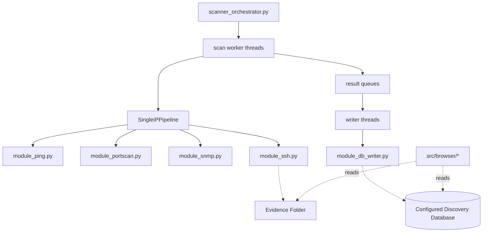

# Network Scanner and Discovery Tool Architecture

## 1. System Overview
The Network Scanner and Discovery Tool is a modular Python utility designed to run locally on technician laptops. Its purpose is to discover reachable network devices, gather hardware/software/topology data, persist normalized results into a configured database, and archive raw CLI evidence for later review.

The design is intentionally split into narrow modules:

- the orchestrator handles targets, scheduling, and database writer coordination
- the single-IP pipeline handles discovery logic for one device
- the protocol modules handle the actual Ping, TCP, SNMP, and SSH work
- the database layer owns persistence rules and transaction boundaries

## 2. Core Architecture

### 2.1 Main Components

#### `scanner_orchestrator.py`
The main entry point of the scanner.

Responsibilities:

- parse CLI arguments
- validate database concurrency settings
- initialize the database schema
- create the run-specific evidence folder
- load `targets.csv`, `keys.yaml`, and `ssh_commands.yaml`
- resolve overlapping target precedence rules
- expand subnets by sweeping only for active hosts
- enqueue single-IP scans into bounded worker queues
- run dedicated DB writer threads so network concurrency is decoupled from DB write concurrency

#### `process_single_ip.py`
The single-device discovery orchestrator.

Responsibilities:

- define the `SingleIPPipeline` class
- execute the per-device workflow:
  - Ping
  - TCP/22 probe
  - SNMP attempts
  - OS profile selection
  - SSH attempts
- return a `SingleIPScanResult` object containing the discovery outcome
- preserve a standalone CLI wrapper for debugging one IP end-to-end

#### `module_db_writer.py`
The database persistence layer.

Responsibilities:

- maintain the write rules for `devices`, `device_inventory`, `device_interfaces`, `device_neighbors`, and `device_configs`
- expose `DatabaseWriter` for low-level table operations
- expose `ScanResultWriter` to persist one completed `SingleIPScanResult` in a single transaction
- keep SQL and merge rules out of the network worker threads

#### `db_loader.py`
The shared database bootstrap and configuration layer.

Responsibilities:

- parse `db.yaml`
- normalize SQLite vs PostgreSQL/MySQL/MariaDB settings
- create the SQLAlchemy engine
- initialize the schema when needed
- configure backend-specific details such as SQLite WAL/busy timeout and external DB pool sizing

#### `module_ping.py`
The ICMP reachability probe.

Responsibilities:

- execute the OS-native `ping` command using `subprocess`
- handle cross-platform argument differences
- return a structured reachability result with timestamp and optional response time

#### `module_portscan.py`
The TCP reachability and subnet sweep component.

Responsibilities:

- perform direct TCP/22 checks for single-IP workflow decisions
- run subnet discovery sweeps using `python-nmap` and the system Nmap binary
- return structured active-host results to the orchestrator

#### `module_snmp.py`
The structured inventory and topology collector.

Responsibilities:

- attempt SNMPv2c and SNMPv3 authentication
- validate credentials with standard system OIDs
- collect normalized inventory fields such as hostname, model, software image, software version, and serial number
- merge standard MIB and Entity-MIB data to improve product and serial identification
- collect interface/address data from both legacy and newer IP tables
- collect topology neighbors from LLDP, CDP, BGP, and OSPF tables
- normalize raw-octet values returned by inconsistent SNMP agents

#### `module_ssh.py`
The deep-dive CLI evidence collector.

Responsibilities:

- use Netmiko to connect to devices over SSH
- execute the command list selected for the resolved OS profile
- save raw command output into timestamped evidence files
- return the evidence path and auth outcome to the pipeline

### 2.2 Browser Components

The `src/browser/` folder contains read-only presentation tooling for viewing the collected data.

- `tabular_browser.py`
  - text- and table-oriented browsing of stored discovery results
- `graphical_browser.py`
  - richer UI for exploring devices and relationships
- `browser_common.py`
  - shared helpers used by the browser layer

These tools consume the database and evidence directory after the scan. They are not part of the active discovery path.

### 2.3 Interaction Map



## 3. Inputs

### 3.1 `targets.csv`
Defines the scan scope.

Each row contains:

- one direct IP address, or
- one subnet in CIDR notation
- zero or more keytags in the remaining columns

Example:

```csv
ip_or_subnet,keytag1,keytag2,keytag3
10.0.0.1,site_a_admin,global_read_only,
192.168.100.0/24,site_a_admin,,
10.1.1.5,,,
```

Meaning:

- if keytags are present, only those credential groups are attempted
- if the row has no keytags, the scanner treats it as unconstrained and tries all configured tags

### 3.2 `keys.yaml`
Defines the credential inventory used by SNMP and SSH.

Typical top-level groups:

- `snmpv2`
- `snmpv3`
- `ssh_password`
- `ssh_key`

The scanner never stores the secrets themselves in the DB. It stores credential references such as:

- `site_a_admin:0` for SNMP
- `site_a_admin:p0` for SSH password
- `site_a_admin:k1` for SSH key

### 3.3 `ssh_commands.yaml`
Maps SNMP-identified platforms to:

- a regex matcher
- a Netmiko `device_type`
- a command list to execute after SSH authentication

This allows SNMP to drive the SSH command profile without hardcoding vendor-specific logic into the orchestrator.

### 3.4 `db.yaml`
Defines the storage backend.

Supported backends:

- SQLite
- PostgreSQL
- MySQL
- MariaDB

The same logical discovery schema is created across all supported backends.

## 4. Concurrency And Scheduling Model

The scanner now separates scan concurrency from DB write concurrency.

CLI controls:

- `--max-workers-per-db-connection`
- `--max-db-connections`

Effective scan concurrency:

```text
total active scan workers =
    max-workers-per-db-connection * max-db-connections
```

### 4.1 Why The Split Exists

Network discovery is mostly I/O-bound and benefits from many concurrent workers.

Database backends behave differently:

- SQLite should effectively have one writer connection
- PostgreSQL/MySQL/MariaDB can tolerate several concurrent writers

By separating the scan workers from the DB writer threads, the scanner can:

- run many device probes in parallel
- keep SQLite safe with one writer
- cap external DB connection usage explicitly

### 4.2 Thread Roles

#### Main thread

- loads config and input files
- reads the target rules
- sweeps subnets
- enqueues single-IP requests

#### Scan worker threads

- dequeue one IP request at a time
- run `SingleIPPipeline`
- perform network I/O only
- return results to the correct writer shard

#### Writer threads

- own one DB connection each
- persist completed scan results
- commit once per device

### 4.3 Queue Backpressure

The orchestrator uses bounded queues to avoid unbounded memory growth.

This matters for large targets such as `/16` ranges:

- the scanner does not build the full expanded address space in memory
- the main thread blocks when the worker queue is full
- workers block on result queues when DB writers lag
- memory usage is bounded by rule count, queue sizes, and scheduled-IP tracking

## 5. Target Precedence And De-duplication

The orchestrator treats CSV rows as target rules, not as a flat list of scan jobs.

For any candidate IP:

- the most specific matching rule wins
- a direct IP overrides a containing subnet
- a longer prefix overrides a shorter prefix
- if prefix lengths tie, the later CSV row wins

Examples:

- `192.168.1.7` overrides `192.168.1.0/24`
- `192.168.1.128/25` overrides `192.168.1.0/24` for `192.168.1.128-255`
- repeated identical rows collapse to the later row

This allows a broad subnet rule and a more specific one-off IP rule to coexist cleanly without duplicate scans.

The orchestrator also tracks already scheduled IPs so each address is scanned at most once per run.

## 6. Single-IP Workflow

For each scheduled IP, `SingleIPPipeline` runs the following phases.

### 6.1 Reachability Phase

Modules involved:

- `module_ping.py`
- `module_portscan.py`

Behavior:

- run one ICMP ping
- run one TCP/22 connect probe
- treat the device as alive if either method succeeds

Purpose:

- allow the scanner to continue when ICMP is blocked but SSH is reachable
- populate the current reachability state even if deeper discovery later fails

### 6.2 SNMP Phase

Module involved:

- `module_snmp.py`

Behavior:

- build credential candidates from the selected keytags
- try the candidates in order
- on success, collect:
  - hostname
  - product/model
  - software image/version
  - serial number
  - uptime
  - power status
  - interfaces
  - neighbors
- on failure, return a summarized reason such as timeout or no valid keys

Important implementation detail:

- the module uses both standard MIB data and fallback/vendor/entity data so the stored inventory is more useful than a raw `sysDescr` dump

### 6.3 OS Profile Evaluation

Implemented in:

- `process_single_ip.py`

Behavior:

- inspect the normalized SNMP inventory
- evaluate `snmp_regex_matcher` entries from `ssh_commands.yaml`
- choose the matching Netmiko device profile and command list
- default to `autodetect` when no specific profile matches

### 6.4 SSH Phase

Module involved:

- `module_ssh.py`

Behavior:

- build SSH credential candidates from the selected keytags
- try them sequentially
- connect with Netmiko
- execute the profile-selected commands
- write raw command output to the evidence folder
- return the evidence path and working credential reference

### 6.5 Final Result Assembly

The completed `SingleIPScanResult` contains:

- target IP
- selected keytags
- timestamps
- reachability outcome
- SNMP outcome plus inventory/interfaces/neighbors
- SSH outcome plus evidence path
- final summarized error list

That object becomes the handoff boundary between network work and database work.

## 7. Database Persistence Model

The scanner writes one completed result per IP.

`ScanResultWriter` performs the DB transaction in this order:

1. ensure the `devices` row exists
2. write current reachability fields
3. write SNMP success or failure state
4. write SSH success or failure state
5. write final `last_error`
6. commit once

This is more efficient than committing after each phase, especially for SQLite.

### 7.1 Table Roles

#### `devices`
The latest per-device run summary.

Stores:

- `ip_address`
- `scan_time`
- `is_alive`
- `ping_responded`
- `ssh_port_open`
- `snmp_responded`
- `ssh_responded`
- `last_error`

#### `device_inventory`
The normalized device identity and software record.

Stores fields such as:

- hostname
- hardware product
- model
- hardware version
- software image
- software version
- serial number
- uptime
- power status
- working SNMP credential reference
- latest working SSH credential reference

#### `device_interfaces`
The discovered interface set.

Persistence rules:

- one logical row per device/interface name
- duplicates are not reinserted
- later scans can fill in a previously blank IP or subnet mask
- interfaces without routed IPs are still retained
- a synthetic `Management` interface can be used when only a standalone management address is discoverable

#### `device_neighbors`
Structured topology relationships.

Sources include:

- LLDP
- CDP
- BGP
- OSPF

Persistence rules:

- append-oriented with deduplication
- older discoveries are retained if a later run does not see the same neighbor again

#### `device_configs`
The SSH evidence history table.

Stores:

- the device ID
- the successful SSH credential reference used for that evidence
- the evidence file path, stored relative to the configured evidence root when possible

## 8. Evidence Files

Each successful SSH capture writes a timestamped text file under the run-specific evidence folder.

Typical content:

- running configuration
- LLDP/CDP detail commands
- platform-specific show commands from the selected profile

The evidence files are the raw forensic/archive output, while the database stores the normalized summary.

## 9. Large-Scale Behavior

Large target ranges can still generate a lot of work, but the architecture avoids the worst memory patterns.

For example, for `192.168.0.0/16`:

- the orchestrator stores the subnet rule, not 65,536 pre-expanded work items
- only active hosts returned by the subnet sweep are considered for scheduling
- scheduling is bounded by the worker queue size
- DB result accumulation is bounded by the writer queues

One caveat remains:

- `module_portscan.sweep_subnet()` currently returns a list of active hosts for that sweep

So the orchestrator is bounded, but the sweep implementation itself still materializes the discovered host list returned by Nmap.

## 10. Design Intent

The architecture is optimized for practical field use:

- modular enough to test components independently
- safe enough to use SQLite on a laptop
- scalable enough to use external SQL backends for larger concurrent runs
- explicit enough that credentials, evidence, topology, and inventory remain understandable after the scan completes

---

## Attribution and License

Copyright 2026 Benjamin Brillat

Author: Benjamin Brillat  
GitHub: [brillb](https://github.com/brillb)

This document is part of the `brillb/network-discovery-scanner` project.

Co-authored using AI coding assist modules in the IDE, including GPT,
Copilot, Gemini, and similar tools.

Licensed under the Apache License, Version 2.0. You may obtain a copy of the
license in the repository `LICENSE` file or at:
<https://www.apache.org/licenses/LICENSE-2.0>

SPDX-License-Identifier: Apache-2.0

