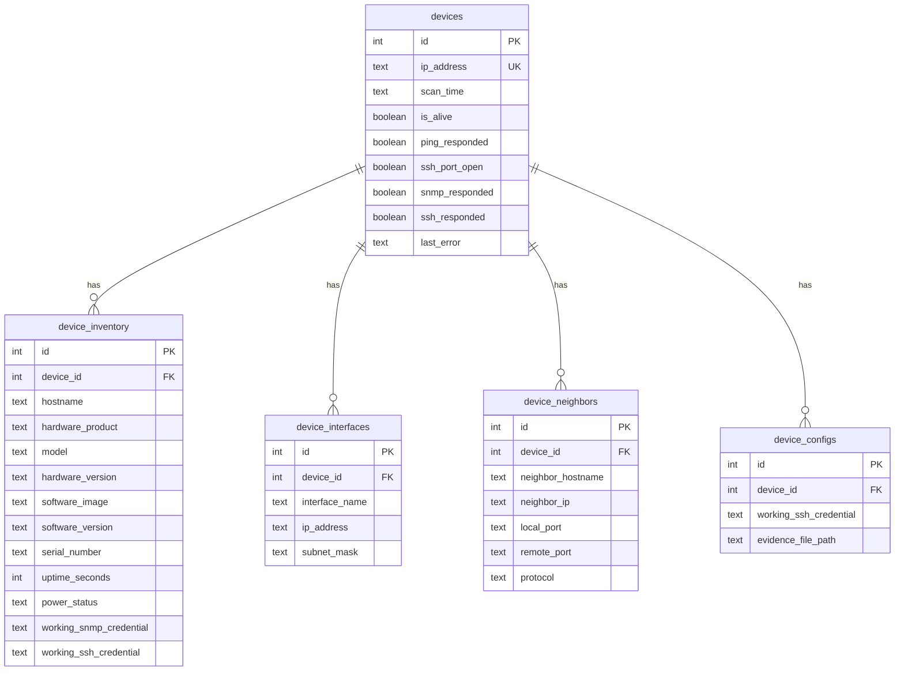
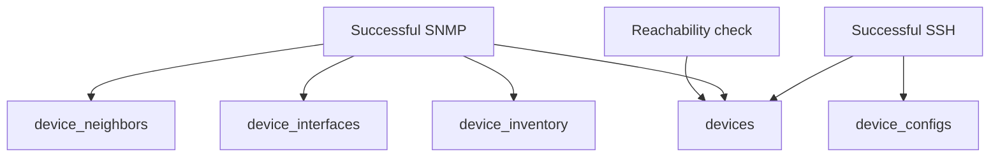

# Database Schema Guide

## Purpose
The scanner writes discovery results into a small relational schema defined in [`db_loader.py`](../src/db_loader.py). The same logical schema is used for SQLite, PostgreSQL, MySQL, and MariaDB.

The design is intentionally simple:

- `devices` is the anchor table.
- The other tables attach inventory, interfaces, neighbors, and SSH evidence to a device record.
- The application performs most deduplication in Python rather than through complex database constraints.

## Schema At A Glance

## Backend Support
The schema is created through SQLAlchemy metadata and can be initialized automatically at runtime.

- SQLite is supported for local serial runs.
- PostgreSQL is supported for parallel runs.
- MySQL and MariaDB are also supported for parallel runs.

The table layout is consistent across all supported backends.

## Table Details

### `devices`
This is the root record for each discovered IP address. It tracks reachability and high-level scan state.

| Column | Type | Notes |
| --- | --- | --- |
| `id` | `Integer` | Primary key, auto-increment |
| `ip_address` | `Text` | Unique IP address for the device record |
| `scan_time` | `Text` | Last scan timestamp written by the application |
| `is_alive` | `Boolean` | True when ping or TCP/22 verification succeeds |
| `ping_responded` | `Boolean` | True when ICMP ping succeeds |
| `ssh_port_open` | `Boolean` | True when the latest TCP/22 check succeeds |
| `snmp_responded` | `Boolean` | True after successful SNMP inventory collection |
| `ssh_responded` | `Boolean` | True after successful SSH collection |
| `last_error` | `Text` | Error summary from the most recent discovery run for this device |

### Population behavior
- `process_single_ip.py` creates the row if the IP does not already exist.
- The row is updated during reachability checks.
- Later phases set `snmp_responded` and `ssh_responded`.
- `last_error` is cleared at the start of a new run and then rewritten with any reachability, SNMP, or SSH failures observed in that run.
- `ip_address` is the only schema-level uniqueness control in the current design.

### Operational notes
- `scan_time` is stored as text in `YYYY-MM-DD HH:MM:SS` format, not as a native datetime column.
- If a device becomes unreachable in a later run, the existing row is updated rather than replaced.
- `ssh_port_open` is written from a dedicated TCP/22 check on every single-IP run, independent of whether ping succeeded.
- `ssh_responded` is set to true on successful SSH collection and explicitly set to false when the SSH phase fails.
- `last_error` is intentionally concise and operational; it is meant for browser visibility, not as a full event log.

### `device_inventory`
This table stores normalized inventory values collected primarily from SNMP.

| Column | Type | Notes |
| --- | --- | --- |
| `id` | `Integer` | Primary key, auto-increment |
| `device_id` | `Integer` | Foreign key to `devices.id` |
| `hostname` | `Text` | SNMP `sysName` when available |
| `hardware_product` | `Text` | Parsed platform or product identifier |
| `model` | `Text` | Model string derived from SNMP data |
| `hardware_version` | `Text` | Hardware revision when available |
| `software_image` | `Text` | Image or platform software identifier |
| `software_version` | `Text` | Parsed software version |
| `serial_number` | `Text` | Chassis or best-available hardware serial from Entity-MIB |
| `uptime_seconds` | `Integer` | Derived from `sysUpTime` |
| `power_status` | `Text` | Environmental or entity-derived health summary |
| `working_snmp_credential` | `Text` | Successful SNMP credential reference in `<keytag>:<index>` format |
| `working_ssh_credential` | `Text` | Latest successful SSH credential reference in `<keytag>:p<index>` or `<keytag>:k<index>` format |

### Population behavior
- The scanner inserts one inventory row per device the first time SNMP succeeds.
- Later successful SNMP runs update the existing row for that `device_id`.
- If SSH succeeds before SNMP has produced inventory data, the scanner creates a minimal inventory row so the latest successful SSH credential remains available from `device_inventory`.
- OS-specific parsing currently includes Cisco IOS or IOS-XE, Junos, and PAN-OS patterns, with Entity MIB data used as an enhancement path for model, revision, and serial collection.

### Operational notes
- This table is effectively one-to-one with `devices` in current application behavior, even though the schema does not enforce a unique constraint on `device_id`.
- `working_snmp_credential` stores a credential reference, not the raw credential payload. For example, `joe_smith_keys:1` means the second SNMP credential under the `joe_smith_keys` tag succeeded.
- `working_ssh_credential` stores the latest successful SSH credential reference for the device inventory row. For example, `global_read_only:k1` means the second SSH key entry under that tag succeeded.

### `device_interfaces`
This table stores interfaces discovered from SNMP, including routed interfaces and named interfaces with no IP data.

| Column | Type | Notes |
| --- | --- | --- |
| `id` | `Integer` | Primary key, auto-increment |
| `device_id` | `Integer` | Foreign key to `devices.id` |
| `interface_name` | `Text` | Interface name such as `GigabitEthernet0/1` or `Vlan1` |
| `ip_address` | `Text` | IPv4 address when available |
| `subnet_mask` | `Text` | IPv4 subnet mask when available |

### Population behavior
- Interface rows are inserted during successful SNMP discovery.
- The scanner deduplicates in application logic, not with a database constraint.
- If an interface row already exists with the same name but blank IP or mask, a later run can fill in the missing values instead of creating a duplicate row.
- The collector can insert named interfaces with empty IP and mask values so the interface list is still useful even on devices with limited routed-interface data.

### Operational notes
- A synthetic `Management` interface may appear when the scanner can infer a management address from legacy IP tables but cannot map it cleanly to a routed interface.
- Current logic focuses on IPv4 persistence in the database even though parts of the SNMP parser can decode IPv6-related structures.

### `device_neighbors`
This table stores structured topology relationships learned from SNMP.

| Column | Type | Notes |
| --- | --- | --- |
| `id` | `Integer` | Primary key, auto-increment |
| `device_id` | `Integer` | Foreign key to `devices.id` |
| `neighbor_hostname` | `Text` | Neighbor system name or identifier |
| `neighbor_ip` | `Text` | Neighbor management or protocol IP when available |
| `local_port` | `Text` | Local interface toward the neighbor |
| `remote_port` | `Text` | Neighbor port when available |
| `protocol` | `Text` | Discovery source such as `LLDP`, `CDP`, `BGP`, or `OSPF` |

### Population behavior
- Neighbor rows are inserted during successful SNMP discovery.
- The collector normalizes and deduplicates neighbor entries before writing them.
- Deduplication is done by matching `device_id`, `neighbor_hostname`, `neighbor_ip`, `local_port`, `remote_port`, and `protocol`.

### Operational notes
- The table is append-oriented across runs. The application does not currently remove stale neighbors that disappear in a later scan.
- LLDP entries can combine system name, chassis ID, and management address data.
- BGP entries can come from standard BGP MIB data or Cisco-specific peer tables.
- OSPF entries are currently IP-centric and may have `Unknown` port fields.

### `device_configs`
This table links a device to SSH success metadata and the saved evidence file path.

| Column | Type | Notes |
| --- | --- | --- |
| `id` | `Integer` | Primary key, auto-increment |
| `device_id` | `Integer` | Foreign key to `devices.id` |
| `working_ssh_credential` | `Text` | Successful SSH credential reference for that evidence row |
| `evidence_file_path` | `Text` | Relative path to the saved SSH evidence file |

### Population behavior
- A new row is inserted each time SSH succeeds.
- The application stores the credential reference, not the raw secret.
- The evidence path is converted to a path relative to the run's evidence root when possible.
- The same successful SSH credential reference is also written to `device_inventory.working_ssh_credential` so the latest per-device credential can be queried without traversing the append-only evidence rows.

### Operational notes
- This table is not deduplicated in current code, so multiple successful SSH runs for the same device can produce multiple rows.
- `device_inventory.working_ssh_credential` and `device_configs.working_ssh_credential` are intentionally duplicated with different scopes. The inventory column is the latest known successful SSH credential for the device, while the configs column preserves which credential was used for each saved evidence file.
- The evidence files themselves contain the command outputs selected from `ssh_commands.yaml` for the matched platform type.

## How Data Flows Into The Schema

The write sequence in [`process_single_ip.py`](../src/process_single_ip.py) is:

1. Insert or find the `devices` row by `ip_address`.
2. Update reachability fields in `devices`.
3. If SNMP succeeds, upsert-like behavior is applied to `device_inventory`, including the successful SNMP credential reference.
4. If SNMP succeeds, interfaces and neighbors are inserted with application-side deduplication.
5. If SSH succeeds, `device_inventory.working_ssh_credential` is refreshed, a `device_configs` row is inserted, and `devices.ssh_responded` is set to true.

## Relationship And Query Patterns
Common reporting starts with `devices` and joins outward:

- Inventory report: `devices` + `device_inventory`
- Interface inventory: `devices` + `device_interfaces`
- Topology view: `devices` + `device_neighbors`
- Evidence lookup: `devices` + `device_configs`

Because the schema is small and flat, it is easy to query for:

- devices discovered but lacking SNMP,
- devices with SSH evidence but missing inventory details,
- all interfaces for a platform family,
- all neighbors discovered through a given protocol,
- all evidence files tied to a site or IP range.

## Design Characteristics And Caveats

- Deduplication is implemented mostly in Python rather than by unique indexes.
- The schema favors operational simplicity over heavy normalization.
- `devices.ip_address` is unique, but child tables do not currently enforce uniqueness at the database level.
- Historical scan versioning is limited. Most device state is overwritten or appended to the same logical device record rather than stored as a full time-series model.
- `device_configs` is the clearest append-only table in current behavior.

These are reasonable tradeoffs for a field-friendly discovery tool, but they matter if the database will later support large-scale analytics or long-term historical trending.

## Recommended Uses For The Schema
The current schema is well suited for:

- operational inventory collection,
- discovery project reporting,
- topology reconstruction,
- migration planning,
- evidence retention,
- and feeding downstream dashboards or export jobs.

If the product later grows into historical trending, compliance drift analysis, or large multi-user inventory operations, the next logical step would be adding scan-run identifiers, stronger uniqueness rules, and explicit history tables.

---

## Attribution and License

Copyright 2026 Benjamin Brillat

Author: Benjamin Brillat  
GitHub: [brillb](https://github.com/brillb)

This document is part of the `brillb/network-discovery-scanner` project.

Co-authored using AI coding assist modules in the IDE, including GPT,
Copilot, Gemini, and similar tools.

Licensed under the Apache License, Version 2.0. You may obtain a copy of the
license in the repository `LICENSE` file or at:
<https://www.apache.org/licenses/LICENSE-2.0>

SPDX-License-Identifier: Apache-2.0

