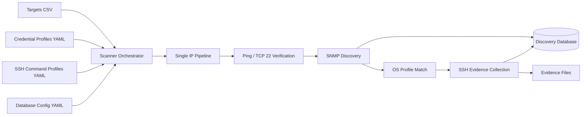
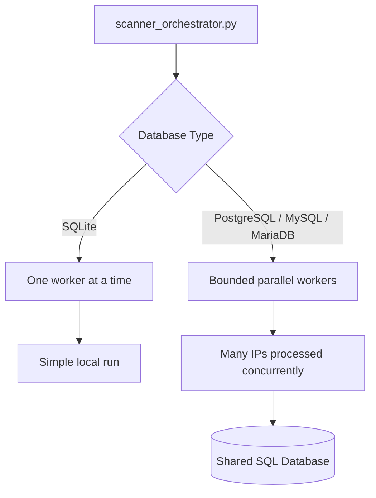
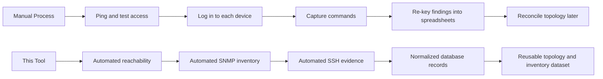

# Network Discovery Product Overview

## Executive Summary
This is a lightweight network discovery, evidence collection, and visualization tool built for real operations teams. It is designed to help a technician, engineer, or field resource discover what is actually on the network, validate device reachability, collect inventory data, map neighbor relationships, and preserve raw CLI evidence without requiring a large centralized platform to get started.

For client teams, it reduces manual effort, accelerates discovery projects, improves the quality of network inventories, and creates a durable dataset that can support planning, lifecycle decisions, migrations, audits, and integration work.

## What The Product Does
This tool:

- Reads a list of target IP addresses or subnets from a CSV file.
- Uses known passwords/keys, or can iterate a list of keys if unknown.
- Verifies reachability with ping and TCP port checks.
- Attempts SNMP discovery to collect structured inventory, interface, uptime, and neighbor information.
- Uses SNMP results to select the right SSH command set for the platform.
- Logs into devices over SSH when possible and saves raw command output as evidence.
- Writes normalized results into a documented relational database schema.
- Exposes the collected data through both tabular and graphical browser views for fast visualization and drill-down.

This is a live inventory collector to crawl an active, operational network.

## Method of Operation
Built for technicians and quick to run, but scalable:

- It can run on one technician's laptop for an ad hoc discovery or site survey.
- It can also run on a VM when a user wants a more persistent or centrally hosted execution point.
- It supports local SQLite for simple single-user operation.
- It supports PostgreSQL, MySQL, and MariaDB when the tech wants shared storage or needs parallel execution.
- It stores both structured records and raw evidence files, which is important for validation, troubleshooting, and auditability.
- Its architecture is componentized, so an experienced technician can inspect, debug, extend, or swap pieces of the workflow without having to rewrite the entire tool.

## Deployment Modes

| Mode | Best Fit | Database | Throughput Model | Typical Use |
| --- | --- | --- | --- | --- |
| Technician laptop | One engineer or field tech | SQLite | Serial | Fast local assessments, branch surveys, pilot runs |
| Technician laptop with remote DB | One engineer needing more speed | PostgreSQL, MySQL, or MariaDB | Parallel | Larger sites, short maintenance windows, time-sensitive discovery |
| VM deployment | Team or repeated use | PostgreSQL, MySQL, or MariaDB | Parallel | Repeatable inventory collection, regional discovery, staged projects |

## How It Works

The orchestrator reads the target list, expands subnets when needed, and launches one discovery pipeline per device. Each device pipeline follows the same sequence:

1. Confirm the host is reachable.
2. Pull structured inventory and topology data over SNMP.
3. Infer the platform profile from SNMP output.
4. Collect raw CLI evidence over SSH.
5. Persist results to the database and evidence folder.

During a run, the orchestrator also presents live terminal status and mirrors output to a per-run logfile stored alongside the evidence files.

Because the system is broken into distinct modules for orchestration, runtime UI/logging, reachability, SNMP, SSH, database loading, and browser presentation, it is relatively easy for a technician to troubleshoot one stage, enhance one capability, or adapt the workflow for a client-specific need.

## Serial Versus Parallel Operation
The product has two distinct operating patterns.

### Local SQLite
SQLite is ideal when the goal is simplicity. A technician can carry the tool on a laptop, point it at a local SQLite file, and run discovery without any external database infrastructure.

That mode is intentionally serial. It is slower, but operationally simple and portable.

### External SQL Database
When the database backend is PostgreSQL, MySQL, or MariaDB, the orchestrator can launch multiple device discovery workers in parallel while dedicated writer threads persist results to the shared database. That separation is what makes large discovery runs practical without tying scan concurrency directly to database write concurrency.

This matters in business terms because time spent waiting for discovery is real labor cost. A serial run may be acceptable for a small branch. A parallel SQL-backed run changes the economics of discovering a large campus, a merger environment, or a migration candidate estate.

## Visualization of Data
Once the network has been crawled/discovered, two methods of browsing the results are provided natively:

- A tabular browser gives a sortable, device-centric view of the inventory, interfaces, neighbors, and saved evidence.
- A graphical browser turns neighbor relationships into an interactive topology map so a user can move from raw discovery into visual understanding quickly.
- Both views help engineers validate the findings without writing raw SQL.
- Both views also make it easier to show results to managers, project teams, and client stakeholders who want to see the environment rather than read command output.

The tabular browser is especially useful when someone wants a fast operational answer such as "what devices were discovered, what model are they, and what evidence exists?" The graphical browser provides insight to connectivity matrices.

## Reduce Discovery Time
Manual discovery typically means:

- Someone exports IP ranges from spreadsheets or old diagrams.
- A technician pings devices, tests SSH manually, and logs in one by one.
- Inventory data is copied into notes.
- Neighbor relationships are reconstructed from screenshots, terminal windows, or partial configs.
- Findings are translated later into another spreadsheet or database.

This tool compresses that work into one repeatable workflow.

This new flow allows:

- Faster site assessments.
- Less dependence on individual engineer note-taking.
- More consistent discovery output across technicians.
- Better reuse of collected data for later phases of a project.

## The Data It Produces
The discovery database is one of the strongest aspects of the product. The schema is simple enough to understand quickly, but structured enough to support downstream reporting and analysis.

Core data domains include:

- Device reachability and scan status.
- Device inventory details such as hostname, platform, model, software, and uptime.
- Routed and named interfaces.
- Neighbor relationships from LLDP, CDP, BGP, and OSPF.
- SSH success state and links to raw evidence files.

The schema is implemented in code and created automatically when the tool initializes the database.

Because the results live in standard SQL tables, they are not trapped inside one interface. They can be queried directly, browsed through the included UIs, or exported to essentially any downstream destination that can consume SQL-derived data.

## How The Data Can Be Used
SQL allows easy export to new use cases:

- Build or validate an authoritative inventory.
- Identify unmanaged, unknown, or unreachable assets.
- Prepare for refresh programs by grouping devices by platform and software version.
- Support migration planning for campus, WAN, or data center projects.
- Accelerate M&A due diligence by quickly characterizing inherited network estates.
- Feed dashboards, reports, or follow-on automation workflows.
- Export to reporting platforms, data warehouses, CSV extracts, BI tools, CMDB workflows, or any other destination the team wants to integrate.
- Compare discovered topology against expected design.
- Retain evidence for audit, troubleshooting, and project handoff.

---

## Attribution and License

Copyright 2026 Benjamin Brillat

Author: Benjamin Brillat  
GitHub: [brillb](https://github.com/brillb)

This document is part of the `brillb/network-discovery-scanner` project.

Co-authored using AI coding assist modules in the IDE, including GPT,
Copilot, Gemini, and similar tools.

Licensed under the Apache License, Version 2.0. You may obtain a copy of the
license in the repository `LICENSE` file or at:
<https://www.apache.org/licenses/LICENSE-2.0>

SPDX-License-Identifier: Apache-2.0

